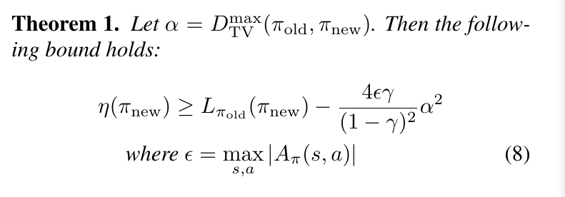
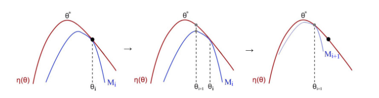
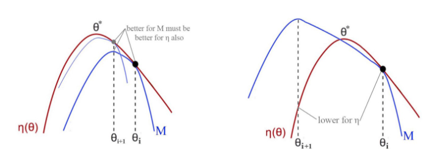
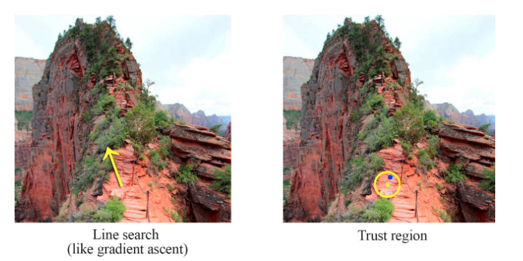
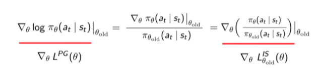
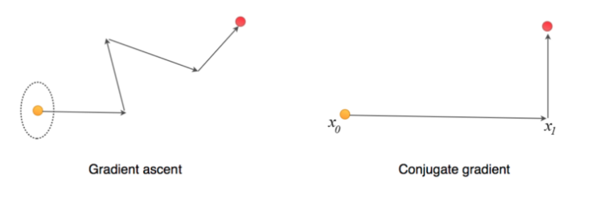
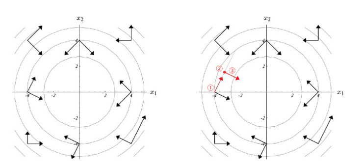
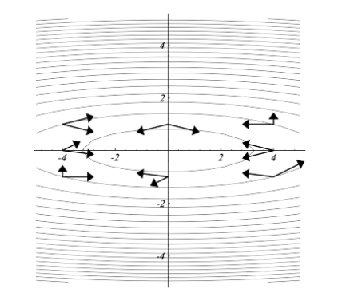

# Study Notes from ZW

## Paper Notes

1. Features:

   1. Iterative procedure for optimizing **policies**
   2. guaranteed monotonic improvement
   3. similar to natural policy gradient methods and is effective for optimizing large nonlinear policies

2. policy optimization categories:

   1. policy iteration methods: estimating value function
   2. policy gradient methods: estimating gradient of the expected return (total reward) obtained from sample trajectories
   3. derivative-free optimization methods: cross-entropy method (CEM) and covariant matrix adaptation (CMA), which treat the return as a black box function to be optimized
      1. preferred on many problems because they are simple to understand and implement

3. Motivation:

   1. Let Approximate Dynamic Programming (ADP) methods and gradient-based methods to beat gradient-free random search
   2. gradient-based optimization algorithms enjoy much better sample complexity (?) guarantees than gradient-free methods
   3. continuous gradient-based optimization has been very successful at supervised learning (Deep Learning)

4. Theory:

   1. Minimizing a certain surrogate objective function guarantees policy improvement with non-trivial step sizes
   2. approximate to the theoretically-justified algorithm
      1. single-path method, which can be applied in the model-free setting
      2. vine method, which requires the system to be restored to particular states, which is typically only possible in simulation

5. Preliminaries

   1. Infinite-horizon discounted MDP  $(\mathcal{S}, \mathcal{A}, P, r, \rho_0, \gamma)$

      1. $\mathcal{S}$: finite set of states
      2. $\mathcal{A}$: finite set of actions
      3. $P: \mathcal{S} \times \mathcal{A} \times \mathcal{S} \rightarrow \mathbb{R}$ : transition probability distribution
      4. $r : \mathcal{S} \rightarrow \mathbb{R}$  reward function
      5. $\rho_0: \mathcal{S} \rightarrow \mathbb{R}$  distribution of the initial stats $s_0$
      6. $\gamma \in (0,1)$ discount factor

   2. Stochastic policy: $\pi: \mathcal{S} \times \mathcal{A} \rightarrow [0,1]$, and let $\eta(\pi)$ denote its expected discount reward

      1. $\eta(\pi ) = \mathbb{E}_{s_0, a_0,\dots} [\sum_{t=0}^{\infty} \gamma^t r(s_t)]$  where $s_0 \sim \rho_0(s_0), a_t \sim \pi(a_t|s_t), s_{t+1}\sim P(s_{t+1}|s_t,a_t)$

   3. State action value function $Q_\pi$, value function $V_{\pi}$ and advantage function $A_{\pi}$

      1. $Q_{\pi}(s_t, a_t) = \mathbb{E}_{s_{t+1}, a_{t+1}, \dots} [\sum_{l=0}^{\infty} \gamma^l r(s_{t+l})]$
      2. $V_{\pi}(s_t) = \mathbb{E}_{a_t,s_{t+1},\dots} [\sum_{l=0}^{\infty} \gamma^l r(s_{t+l})]$
      3. $A_\pi(s,a)=Q_{\pi}(s,a) - V_\pi(s)$

   4. expected return of another policy $\tilde{\pi}$ in terms of advantage over $\pi$, accumulated over timesteps

      1. $\eta(\tilde{\pi} ) = \eta(\pi) + \mathbb{E}_{s_0, a_0,\dots \sim \tilde\pi} [\sum_{t=0}^{\infty} \gamma^t A_\pi(s_t, a_t)]  \ \ \ \  (1)$
      2. $\mathbb{E}_{s_0, a_0,\dots \sim \tilde\pi}$ indicates that actions are sampled $a_t \sim \tilde\pi(\cdot|s_t)$

   5. Rewrite equation $(1)$ into sum over states instead of timesteps

      1. $$\eta(\tilde{\pi} ) = \eta(\pi) + \sum_{t=0}^{\infty}\sum_sP(s_t = s |\tilde \pi) \sum_a \tilde\pi(a|s)\gamma^t A_\pi(s, a)$$

         $$\eta(\tilde{\pi} ) = \eta(\pi) + \sum_s\sum_{t=0}^{\infty}\gamma^tP(s_t = s |\tilde \pi) \sum_a \tilde\pi(a|s) A_\pi(s, a)$$

         $$\eta(\tilde{\pi} ) = \eta(\pi) + \sum_s\rho_{\tilde\pi(s)} \sum_a \tilde\pi(a|s) A_\pi(s, a) \ \ \ \ \ (2)$$

      2. where the unnormalized discounted visitation frequencies is $\rho_\pi(s) = P(s_0 = s) + \gamma P(s_1 = s) + \gamma^2 P(s_2 = 2) + \dots$

      3. This equation implies that any policy update $\pi \rightarrow \tilde\pi$ that has a nonnegative expected advantage at _every_ state s, $\sum_a\tilde\pi(a|s) A_\pi(s, a) \ge 0$, is guaranteed to increase the policy performance $\eta$ . But in the approximate setting, it will typically be unavoidable, due to estimation and approximation error, that there will be some states $s$ whose expected advantage is negative.

   6. Local approximation to $\eta$

      1. $L_\pi(\tilde\pi) =  \eta(\pi) + \sum_s\rho_{\pi(s)} \sum_a \tilde\pi(a|s) A_\pi(s, a) \ \ \ \ (3) $ 
         1. it uses visitation frequence $\rho_\pi$ instead of $\rho_{\tilde\pi}$, **ignoring changes in state visitation density due to changes in the policy**
         2. However, if we have a parameterized policy $\pi_{\theta}$, .., then $L_\pi$ matches $\eta$ to first order. That is, for any parameter value $\theta_0$
            1. $L_{\pi_{\theta_0}} = \eta(\pi_{\theta_0})$
            2. $\nabla_\theta L_{\pi_{\theta_0}}(\pi_\theta)|_{\theta=\theta_0} = \nabla_\theta \eta(\pi_\theta)|_{\theta=\theta_0} \ \ \ \ \ (4)$
      2. Equation (4) implies that a sufficiently smalls step $\pi_{\theta_0} \rightarrow \tilde\pi$ that improves $L_{\pi_{\theta_{\text{old}}}}$ will also improve $\eta$, but **does not give us any guidance on how big of a step to take**.

   7. Policy updating scheme: conservative policy iteration. It provide explicit lower bounds on the improvement of $\eta$ by **using new policy as a mixture of current policy and argmax policy.**

      1. 

6. Monotonic Improvement Guarantee for General Stochastic policies

   1. extend  mixture policies to general stochastic policies by **replacing $\alpha$ with a distance measure between $\pi$ and $\tilde\pi$ and changing the constant $\epsilon$ appropriately**

      1. distance measure: total variation divergence $D_{TV}(p||q) = \frac{1}{2}\sum_i|p_i-q_i|$ for discrete probability distributions.  $D_{TV}^{\max}(\pi||\tilde\pi) = \max_s D_{TV}(\pi(\cdot|s) || \tilde\pi(\cdot|s))$

   2. 

   3. using the relationship between total variation divergence and KL divergence: $D_{TV}(p||q)^2 \le D_{KL}(p||q)$ then the equation (8) becomes 

      $\eta(\tilde\pi) \ge L_\pi(\tilde\pi) - C D_{KL}^\max(\pi, \tilde\pi)$, where $C = \frac{4\epsilon \gamma}{(1-\gamma)^2}$     (9)

   4. 

      

   ## Notes about TRPO Online

   1. Challenges about Policy Gradient (PG) method. Gradient:  $g = \nabla_\theta J(\pi_\theta) = \mathbb{E}_{\tau \sim \pi_\theta}[\sum _{t=0}^\infty \gamma^t\nabla_\theta log\pi_\theta (a_t|s_t) A^{\pi_\theta}(s_t, a_t)]$ , $\theta_{k+1} = \theta_k + \alpha g$

      1. first-order optimizer is not very accurate for curved areas
         1. Too large step size leads to a disaster, but if the step is too small, the model learns too slow
      2. Hard to have a proper Learning rate in RL
      3. How to constraint the policy changes so we don't make too aggressive moves? How to map the changes between policy and parameter space?  [This is TRPO wants to achieve]
      4. sample the whole trajectory for just one policy update and it is not sample efficient
   
   2. Minorize-Maximization MM Algorithm
   
      1. **iteratively** maximize a lower bound function to approximate the expected reward locally
   
         
   
      2. Steps:
   
         1. initial policy guess
         2. find a lower bound M that approximates the expected reward $\eta$ locally at the current guess
         3. locate the optimal point for M and use it for the next guess
         4. repeat 2 ~ 3 
   
      3. M should be easier to optimize than $\eta$. Here, M is a quadratic equation $ax^2 + bx +c$ in the vector form: $g\cdot (\theta - \theta_{old}) - \frac{\beta}{2}(\theta - \theta_{old})^T F (\theta - \theta_{old})$
   
      4. why MM algo converges to the optimal policy
   
         1. If M is a lower bound, it will never cross the red line $\eta$.  Suppose the expected reward for the new policy is lower in $\eta$, then M must cross $\eta$, which is a contradiction.
   
            
   
      5. So by optimizing a lower bound function approximating $\eta$ locally, it **guarantees** policy improvement every time and lead us to the optimal policy eventually. 
   
   3. Trust Region
   
      1. Two major optimization methods: line search and trust region
   
         1. Gradient descent: determine the descending direction first and then take a step towards that direction
         2. TR: determine the maximum step size first and then locate the optimal point within the trust region.
            1. $\max_{s\in\mathbb{R}^n} m_k(s) , s.t. ||s||\le \delta$
            2. $m$ is out approximation to the original objective function $f$. Our new objective now is finding the optimal point for $m$ within the radius $\delta$
            3. To control the learning speed better, we can expand or shrink $\delta$ in runtime according to the curvature of the surface.
   
         
   
         
   
   4. Importance Sampling
   
      1. When calculates the expected value of $f(x)$ where $x$ has a data distribution $p$ : $\mathbb{E}_{x\sim p}[f(x)]$, we can sample data from $q$ and use the probability ratio between $p$ and $q$ to recalibrate the result $\mathbb{E}_{x\sim q}[\frac{f(x)p(x)}{q(x)}]$
   
      2. In PG, we use the current policy to compute the policy gradient, so whenever the policy is changed, we collect new samples. Old samples are not reusable, which is poor sample efficiency. With IS, our objective can be rewritten and we can use samples from an old policy to calculate the policy gradient
   
         1. Old:    $\nabla_\theta J(\theta) = \mathbb{E}_{\tau \sim \pi_\theta}[\nabla_\theta log\pi_\theta (\tau) r(\tau) ]$ 
         2. New: $\nabla_{\theta^\prime} J(\theta^\prime) = \mathbb{E}_{\tau \sim \pi_\theta}[\sum_{t=1}^T\nabla_{\theta^\prime} log\pi_{\theta^\prime} (a_t | s_t) (\Pi_{t^\prime=1} ^t \frac{\pi_{\theta^\prime}(a_{t^\prime }|s_{t ^\prime})}{\pi_{\theta}(a_{t^\prime }|s_{t ^\prime})})(\sum_{t^\prime = t} ^ T r(s_{t ^\prime}, a_{t ^\prime}) ]$
   
      3. Limitation: 
   
         1. IS estimation has variance of $\frac{1}{N}(E_{x\sim P}[\frac{P(x)}{Q(x)}f(x)^2] - E_{x \sim P}[f(x)]^2)$ and if the $\frac{P(x)}{Q(x)}$ ratio is high then the variance of the estimation may explode. Therefore, we cannot use old samples for too long, we still need to resample trajectory pretty frequently using the current policy (say every 4 iterations).
   
      4. Objective function using IS
   
         1. $g = \nabla_\theta J(\pi_\theta) = \mathbb{E}_{\tau \sim \pi_\theta}[\sum _{t=0}^\infty \gamma^t\nabla_\theta log\pi_\theta (a_t|s_t) A^{\pi_\theta}(s_t, a_t)]$ , $\theta_{k+1} = \theta_k + \alpha g$
   
         2. objective function corresponding to above gradient (assuming $\gamma = 1$ for simplicity reason) $L^{PG}(\theta) = \hat{\mathbb{E}_t}[log \pi_{\theta}(a_t|s_t)\hat{A_t}]$
   
         3. Express in IS way: $L^{IS}_{\theta_{old}}(\theta) = \hat{\mathbb{E}_t}[\frac{ \pi_{\theta}(a_t|s_t)}{ \pi_{\theta_{old}}(a_t|s_t)}\hat{A_t}]$
   
         4. The derivatives for both objective functions are the same, which gave a hint about how to restrict the policy change and this is a key foundation of many advanced PG methods.
   
            
   
      5. Conjugate Gradient (CG)
   
         
   
         1. solve a linear equation or optimize a quadratic equation. more efficient in solving those problems than the gradient descent.
   
            1. When $A$ is symmetrical and positive definite, solving $Ax = b$  is equivalent to $\max_x f(x) = \frac{1}{2}x^TAx - b^Tx$, since $f^\prime(x) = Ax - b = 0$
   
         2. CG method is a line search method without undoing part of the moves done previously. It optimizes a quadratic equation in fewer step than the gradient ascent. 
   
            
   
            1. start the ascent in one particular direction
   
            2. settle down in the optimal point for that direction
   
            3. find a new direction $d_j$ which is conjugate to any previous moving directions $d_i$
   
               1. $d_{i}^T A d_j = 0$, where $A$ is the matrix in the quadratic euqation.
   
                  
   
   
   
   